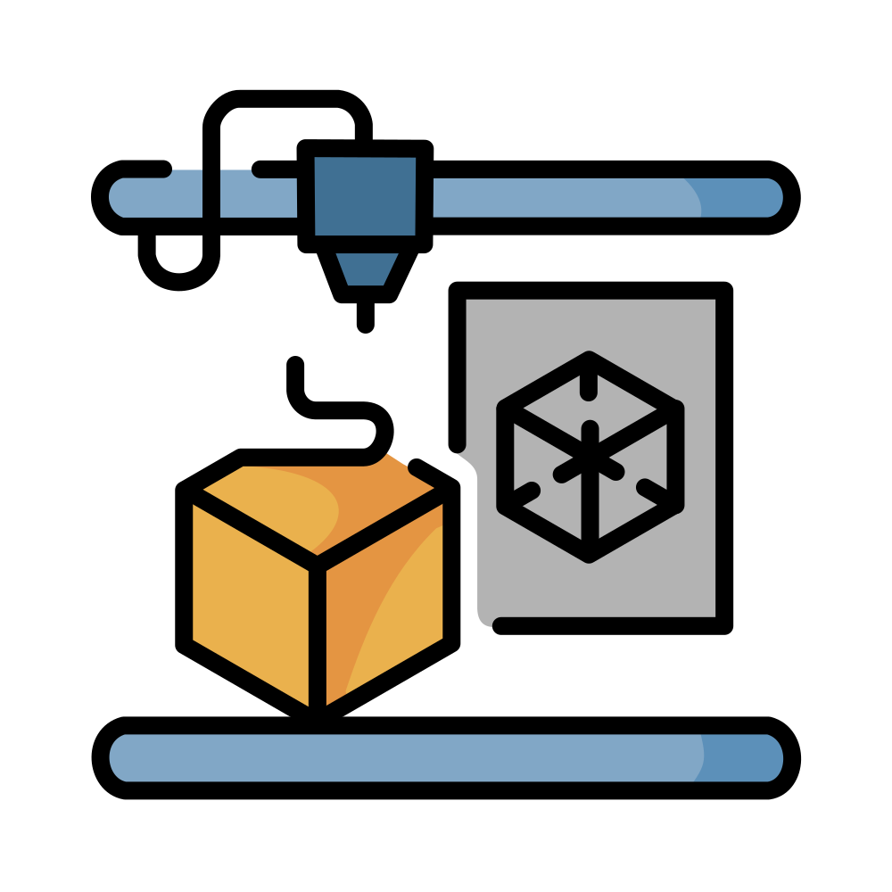

# CloudLess Print Bridge

<div align="center">
  

  [](https://robertneat.github.io/CloudLess_Print_Bridge/)
</div>

A local, LAN-only bridge system for a Bambu Lab A1 3D printer. Every service
in this repo talks to the printer, its microSD card, and its cameras over
your own network — there is no cloud account, no vendor relay, and no
internet dependency required for normal operation..

Management dashboard screenshot:


Video dashboard screenshot:


File browser screenshot:


Polish translation: [README_pl.md](./README_pl.md).

## What this is

Bambu Lab's stock LAN-only mode gives you MQTT, FTPS, and a local camera
feed, but no unified way to drive them from one UI. CloudLess Print Bridge
fills that gap with a small set of purpose-built services, each responsible
for one transport, plus a dashboard that ties them together:

- **Printer control/monitoring** over the printer's own MQTT/TLS broker.
- **SD card file management** over the printer's FTPS server.
- **Camera capture, live preview, and recording** via custom ESP32-S3 camera
  firmware talking to its own backend.
- **One dashboard UI** presenting all of the above as a single management
  surface.

## Architecture

| Component                        | Role                                                                                                                                                                                                                          |
| -------------------------------- | ----------------------------------------------------------------------------------------------------------------------------------------------------------------------------------------------------------------------------- |
| `apps/octo-management-dashboard` | Angular frontend — the actual UI. Printer control/monitoring, an SD-card file browser, and a camera/video dashboard with live preview, composed as customizable gridster widgets.                                             |
| `apps/mqtt-puppeteer`            | NestJS backend. Connects to the printer's MQTT/TLS broker, merges partial state reports into a domain model, and exposes REST + Socket.IO.                                                                                    |
| `apps/ftps-remote-manager`       | NestJS backend. Connects to the printer's FTPS server (microSD card) and exposes REST for listing, downloading, uploading, moving, and deleting files.                                                                        |
| `apps/video-service-hub`         | NestJS backend for the M5Stack UnitCam S3 cameras. Proxies commands to camera firmware, ingests JPEG/MJPEG/WAV uploads, fans out live MJPEG to multiple viewers, and keeps recording manifests and camera telemetry/presence. |
| `packages/printer-contracts`     | Shared, transport-agnostic TypeScript DTOs for the printer domain model (AMS units/slots, external spool, operation results), consumed by the backends and the dashboard.                                                     |
| `firmware/m5-stack-unitcam-s3`   | ESP32-S3 firmware (PlatformIO) for the cameras, implementing the capture/recording/live-stream contract that `video-service-hub` expects.                                                                                     |

The dashboard is the only thing an end user opens. It calls
`mqtt-puppeteer` for printer state and commands, `ftps-remote-manager` for
file operations, and `video-service-hub` for camera control and live/media
streaming; each backend owns exactly one transport into the printer or its
peripherals.

## Repo layout

- `apps/` — the four applications described above, each with its own README.
- `packages/` — shared library code (`printer-contracts`).
- `firmware/` — camera firmware (PlatformIO project, own README/README_pl pair).
- `docs/` — the published GitHub Pages wiki (dashboard usage docs); the
  underlying cross-cutting markdown docs (architecture, day-to-day dev
  commands, operations/CI-CD, environment variable reference) live in
  `docs/readmes/`.
- `.github/` — GitHub Actions workflows, Dockerfiles (`.github/docker/`), CI
  pipeline steps and docs. `infrastructure/README.md` describes a Docker/Compose
  layout that was planned but never built — the actual Dockerfiles and compose
  file live under `.github/docker/` and `deploy/`, see `docs/readmes/operations.md`.

## Prerequisites

- Node.js compatible with `pnpm@11.17.0` (pinned via `packageManager` in the
  root `package.json`).
- pnpm `11.17.0` (the workspace uses pnpm workspaces; see
  `pnpm-workspace.yaml`).
- Network access to the printer's LAN IP, MQTT/TLS port, FTPS port, and
  access code (from the printer's own network settings screen), plus the
  camera(s)' LAN addresses if you're running `video-service-hub`.

## Quick start

```bash
pnpm install
```

Then run whichever services you need, each from the repo root:

```bash
pnpm dev:mqtt       # mqtt-puppeteer   — printer control/monitoring
pnpm dev:ftps       # ftps-remote-manager — SD card file management
pnpm dev:video      # video-service-hub   — cameras, live preview, recording
pnpm dev:dashboard  # octo-management-dashboard — the UI
```

Repo-wide scripts also exist for build/test/lint across every workspace
package:

```bash
pnpm build   # pnpm -r build
pnpm test    # pnpm -r test
pnpm lint    # pnpm -r lint
```

Each backend needs its own environment configuration (printer IP, MQTT/FTPS
credentials, ports, storage paths, etc.) before it will do anything useful.
None of that is duplicated here — see each app's own README for its full
environment-variable reference, REST/Socket.IO surface, and any
service-specific setup notes:

- [apps/mqtt-puppeteer/README.md](./apps/mqtt-puppeteer/README.md)
- [apps/ftps-remote-manager/README.md](./apps/ftps-remote-manager/README.md)
- [apps/video-service-hub/README.md](./apps/video-service-hub/README.md)
- [apps/octo-management-dashboard/README.md](./apps/octo-management-dashboard/README.md)
- [packages/printer-contracts/README.md](./packages/printer-contracts/README.md)
- [firmware/m5-stack-unitcam-s3/README.md](./firmware/m5-stack-unitcam-s3/README.md)

## Further documentation

Cross-cutting docs live in [`docs/readmes/`](./docs/readmes/) (`docs/` itself is
the published GitHub Pages wiki):

- [docs/readmes/architecture.md](./docs/readmes/architecture.md) — how the pieces talk to each other.
- [docs/readmes/development.md](./docs/readmes/development.md) — day-to-day dev-cycle commands.
- [docs/readmes/operations.md](./docs/readmes/operations.md) — this repo's CI/CD and deployment configuration.
- [docs/readmes/environment-variables.md](./docs/readmes/environment-variables.md) — full environment variable reference.
- [docs/readmes/running-ghcr-images.md](./docs/readmes/running-ghcr-images.md) — running published GHCR images with your own `.env`, on your own ports.
- [docs/readmes/shared-contracts.md](./docs/readmes/shared-contracts.md) — pattern for sharing types/DTOs/contracts across services.

## License

MIT — see `package.json`.
