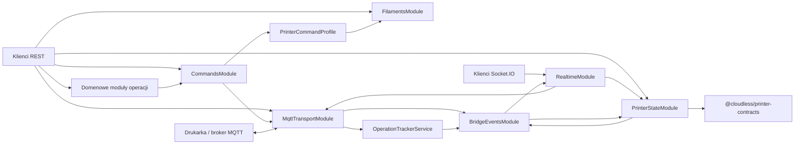
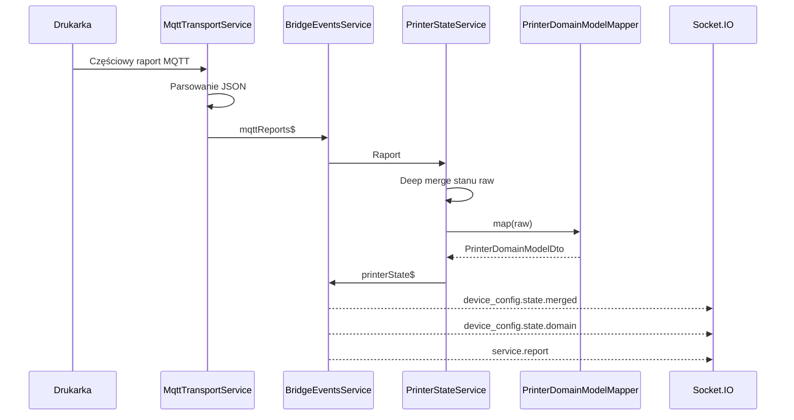
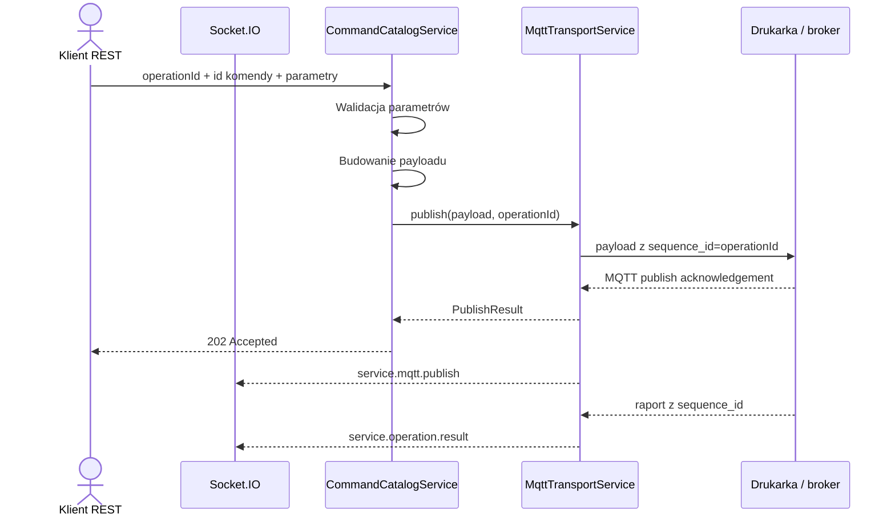

# Architektura mqtt-puppeteer

## Cel serwisu

`mqtt-puppeteer` jest lokalnym adapterem między protokołem MQTT/TLS drukarki a
aplikacjami korzystającymi z REST lub Socket.IO. Serwis:

1. odbiera częściowe raporty drukarki;
2. utrzymuje kompletny stan protokołowy przez deep merge;
3. mapuje stan na stabilny model biznesowy;
4. publikuje surowe albo nazwane komendy;
5. rozsyła statusy, raporty i oba modele stanu w czasie rzeczywistym.

## Moduły



### `AppConfigModule`

Globalny provider konfiguracji. Odpowiada za:

- wczytanie opcjonalnego `.env`;
- walidację liczb i wartości logicznych;
- zbudowanie domyślnych topiców z `MQTT_PUPPETEER_PRINTER_SN`;
- konfigurację zewnętrznego katalogu komend;
- konfigurację katalogu filamentów i topologii AMS;
- wskazanie opcjonalnego template'u stanu.

Hasło MQTT pozostaje wyłącznie w konfiguracji procesu i nie jest ujawniane
przez publiczne API.

### `MqttTransportModule`

Adapter infrastrukturalny odpowiedzialny wyłącznie za MQTT:

- połączenie `mqtts`;
- MQTT 3.1.1 (`protocolVersion: 4`);
- subskrypcję topicu raportowego;
- parsowanie JSON lub zachowanie tekstu;
- publikację obiektów JSON do topicu komend;
- raportowanie stanu połączenia.

Transport nie mapuje modelu biznesowego, nie wykonuje deep merge i nie zna
Socket.IO. Raporty oraz status publikuje do `BridgeEventsService`.

Brak pełnej konfiguracji nie zatrzymuje aplikacji. Transport pozostaje wtedy
offline, dzięki czemu nadal działają odczyty, katalog i symulacja ruchu.

### `BridgeEventsModule`

Wewnętrzny bus zdarzeń oparty na `ReplaySubject(1)`:

- `mqttReports$`;
- `mqttStatus$`;
- `printerState$`.

Replay ostatniej wartości umożliwia późniejszym subskrybentom uzyskanie
aktualnego zdarzenia bez bezpośredniego wiązania modułów.

Bus jest granicą między transportem, projekcją stanu i Socket.IO. Nie zawiera
logiki biznesowej.

### `PrinterStateModule`

Odpowiada za dwie reprezentacje:

- `raw` — pełny obiekt protokołu drukarki;
- `domain` — stabilny `PrinterDomainModelDto`.

Serwis subskrybuje `mqttReports$`. Raport będący obiektem jest scalany ze
stanem raw, następnie mapper tworzy od nowa projekcję domenową i publikuje
`printerState$`.

#### Reguły deep merge

- obiekt + obiekt: scalanie rekurencyjne;
- tablica: zastąpienie całej tablicy;
- skalar lub `null`: zastąpienie;
- pole nieobecne w patchu: zachowanie;
- nowe pole: dodanie;
- `__proto__`, `constructor`, `prototype`: ignorowanie.

Stan zaczyna się od `{}`. Jeżeli ustawiono
`MQTT_PUPPETEER_PRINTER_STATE_TEMPLATE_PATH`, zaczyna się od niezależnej kopii wskazanego
obiektu JSON.

Każdy publiczny odczyt zwraca kopię, aby konsument nie mógł zmienić stanu
przechowywanego przez proces.

### Mapper domenowy

Token `PRINTER_DOMAIN_MAPPER` oddziela mechanizm stanu od protokołu modelu
drukarki.

Aktualny provider `BambuLabA1Mapper`:

- mapuje temperatury;
- normalizuje status zadania;
- przelicza pozostały czas z minut na sekundy;
- mapuje postęp i warstwy;
- przelicza skalę wentylatorów `0..15` na procenty;
- mapuje światło i prędkość;
- odrzuca puste, logiczne, nieskończone i pozazakresowe wartości liczbowe;
- buduje jawne `AmsUnitDto`, `AmsSlotDto` i `ExternalSpoolDto` zamiast
  kopiowania obiektów protokołu.

Dla innego protokołu należy dostarczyć nową implementację
`PrinterDomainModelMapper` i zmienić provider w `PrinterStateModule`. Deep
merge, REST, Socket.IO i kontrakt domenowy nie wymagają zmian.

### `CommandsModule`

Katalog komend jest osobną warstwą aplikacyjną:

1. wyszukuje definicję po `id`;
2. odrzuca nieznane parametry;
3. waliduje typ, wymaganie, enum, wzorzec i zakres;
4. deleguje budowanie do aktywnego profilu drukarki;
5. rejestruje operację i przekazuje payload do `MqttTransportService`.

Identyfikatory i parametry są kontraktem domenowym frontendu. Provider
`PRINTER_COMMAND_PROFILE` tłumaczy je na indywidualne pola protokołu
drukarki. Wbudowany profil A1 oraz jego definicje są częścią projektu; serwis
nie czyta ani nie modyfikuje `MQTT_WIKI` w runtime.

### `FilamentsModule`

Oddziela dane materiałowe od komend i konkretnej drukarki:

- typ definiuje `trayType`, kolor domyślny i zakres temperatur;
- metatyp wiąże typ z marką oraz `trayInfoIdx`;
- wynikowa definicja łączy oba zbiory i może zawierać nadpisania temperatur.

`FilamentCatalogService` jest używany przez profil komend podczas
`load-filament` oraz `set-filament`. Katalog może zostać zastąpiony lub
rozszerzony plikiem wskazanym przez `MQTT_PUPPETEER_FILAMENT_CATALOG_PATH`.

### `PrinterCommandProfile`

Profil jest wymiennym adapterem między komendami domenowymi a MQTT konkretnej
drukarki. Udostępnia:

- identyfikator modelu/profilu;
- topologię `unitCount × slotsPerUnit` i informację o szpuli zewnętrznej;
- zbiór builderów komend.

Profil A1 mapuje źródło AMS na `ams_id`, lokalny `slot_id` i globalny
`target`. Dla szpuli zewnętrznej stosuje identyfikatory protokołu A1.
Inny model może dostarczyć własny provider bez zmiany API frontendu.

#### Wymiana profilu komend

`MQTT_PUPPETEER_COMMAND_CATALOG_PATH` wskazuje plik JSON z definicjami:

- `MQTT_PUPPETEER_COMMAND_CATALOG_MODE=replace` — używany jest wyłącznie wskazany katalog;
- `MQTT_PUPPETEER_COMMAND_CATALOG_MODE=extend` — definicje są dołączane, a identyczne `id`
  nadpisują wbudowane.

Payload może korzystać z placeholderów `{{parameter}}`. Pełny placeholder
zachowuje typ JSON, a placeholder wewnątrz tekstu jest interpolowany jako
string.

Symulacja ruchu korzysta z tej samej walidacji i tego samego buildera co
wykonanie, ale nie wywołuje transportu.

Globalny interceptor REST generuje `operationId`. Transport umieszcza go
w `sequence_id`, a `OperationTrackerService` koreluje raport urządzenia
i emituje dokładnie jeden wynik końcowy: `acknowledged`, `rejected` albo
`timed_out`.

### `RealtimeModule`

Adapter Socket.IO pod namespace `/printer`. Nie tworzy klienta MQTT i nie
przetwarza raportów. Subskrybuje wewnętrzny bus i tłumaczy zdarzenia na:

- `service.status`;
- `service.report`;
- `device_config.state.merged`;
- `device_config.state.domain`;
- `service.mqtt.publish`;
- `service.operation.result`;
- `service.error`.

Gateway nie przyjmuje komend. Frontend używa REST do operacji, a Socket.IO
pozostaje odbiorczym projektorem zdarzeń serwisu i urządzenia.

### Kontrolery REST

Kontrolery są cienkimi adapterami:

- `MqttTransportController` — konfiguracja, status i ostatni raport;
- `PrinterStateController` — osobne stany merged i domain (domain zawiera
  teraz również śledzoną `position`);
- `CommandsController` — lista, wykonanie nazwanej komendy i raw publish;
- `DeviceConfigController`, `PrintJobController`,
  `FilamentOperationsController` i `MovementController` — każdy we własnym
  pliku oraz module domenowym;
- `PrinterControlsController` — cienkie endpointy pod widgety dashboardu
  (światło, wentylator, prędkość druku, temperatury), delegujące do
  `CommandCatalogService` bez własnej wiedzy o modelu drukarki;
- `TelemetryController` — bufor historii telemetrii do zasilenia wykresów;
- `FilamentsController` — scalone definicje filamentów.

Interaktywna dokumentacja tych kontrolerów (Swagger/OpenAPI) jest
generowana w `main.ts` i dostępna pod `/docs`.

Pełny kontrakt znajduje się w [endpoints.md](./endpoints.md).

## Współdzielony kontrakt biznesowy

Model domenowy znajduje się w osobnym pakiecie:

```text
packages/printer-contracts
```

Import:

```ts
import type { PrinterDomainModelDto } from '@cloudless/printer-contracts';
```

Pakiet eksportuje również `PrinterCommandId`, parametry zarządzania
filamentem, `AmsTopologyDto` oraz definicje katalogu filamentów.

Pakiet jest niezależny od NestJS, MQTT i Socket.IO. Backend używa go podczas
mapowania i emisji zdarzeń, a przyszły frontend może użyć go dla:

- typowania odpowiedzi `GET /device_config/state/domain`;
- `state` zdarzenia `device_config.state.domain`;
- store'u stanu i komponentów UI.

Kontrakt biznesowy nie zawiera nazw pól MQTT BambuLab. Zmiana protokołu
drukarki wymaga zmiany mappera, a nie frontendu.

## Przepływ raportu



Niepoprawny JSON pozostaje dostępny jako ostatni raport tekstowy, ale nie
zmienia stanu raw ani modelu domenowego.

## Przepływ nazwanej komendy



Odpowiedź drukarki wraca niezależnym przepływem raportowym. Publish
acknowledgement nie jest równoznaczny z wykonaniem polecenia przez urządzenie.

## Rozszerzanie serwisu

### Inny zestaw komend, ten sam protokół raportów

Wystarczy ustawić `MQTT_PUPPETEER_COMMAND_CATALOG_PATH` oraz tryb katalogu. Kod nie wymaga
przebudowy.

### Inny model drukarki z podobnym transportem

Należy:

1. skonfigurować topics przez `MQTT_PUPPETEER_MQTT_REPORT_TOPIC` i `MQTT_PUPPETEER_MQTT_COMMAND_TOPIC`;
2. dostarczyć katalog komend;
3. dodać mapper do `PrinterDomainModelDto`;
4. opcjonalnie wskazać template raw.

### Rozszerzenie modelu biznesowego

Zmiana zaczyna się w `@cloudless/printer-contracts`. Następnie należy
zaktualizować mapper oraz konsumentów. Dzięki temu TypeScript wykryje miejsca,
które wymagają dostosowania, zarówno w backendzie, jak i frontendzie.

### `PrinterPositionService`

Śledzi pozycję głowicy metodą dead reckoning — raport `pushall` A1 nie
zawiera aktualnej pozycji XYZ. Subskrybuje `mqttPublications$` (status
`published`) i:

- dla komendy `home` ustawia pozycję na stałe współrzędne (128, 128, 10) —
  rzeczywistą pozycję głowicy po zakończeniu sekwencji `G28` na drukarce
  Bambu Lab A1, niezależną od `machineEnvelope` profilu (`homed: true`);
- dla każdej innej publikacji przekazuje jej payload przez
  `PrinterCommandProfile.inspectPayload()` i, jeśli zwróci `targetPosition`,
  aktualizuje odpowiednie osie (`commanded: true`);
- zeruje pozycję do `source: "unknown"` przy utracie połączenia MQTT
  (`mqttStatus$.connected === false`), bo wcześniejsze wyliczenie przestaje
  być wiarygodne.

Wynik jest dołączany do `PrinterDomainModelDto.position` przez
`PrinterStateService.getDomain()`.

### `TelemetryHistoryService`

Utrzymuje ograniczony bufor kołowy próbek telemetrii (postęp, temperatury,
prędkości wentylatorów), wyliczanych z `PrinterDomainModelDto` przy każdej
aktualizacji `printerState$` — nie z surowych pól protokołu drukarki, więc
bufor pozostaje ważny niezależnie od aktywnego profilu. Rozmiar bufora
konfiguruje `MQTT_PUPPETEER_TELEMETRY_HISTORY_CAPACITY` (domyślnie 720).
Używany przez `GET /telemetry/history`, głównie do zasilenia wykresów
dashboardu przy starcie.

### `PrinterProfileModule`

Globalny moduł dostarczający pojedynczą instancję aktywnego
`PrinterCommandProfile` (`PRINTER_COMMAND_PROFILE`). Wydzielony z
`CommandsModule`, ponieważ profil jest teraz potrzebny również w
`MqttTransportModule` (bezpieczeństwo payloadu) i `PrinterStateModule`
(śledzenie pozycji) — jedno miejsce podmiany profilu zamienia zachowanie
wszystkich trzech naraz.

### Podwójna weryfikacja granic ruchu i zamknięcie obejścia `commands/raw`

`PrinterCommandProfile` udostępnia dwie dodatkowe metody poza katalogiem
komend:

- `getMachineEnvelope()` — bezpieczny zakres X/Y/Z, czytany przez
  `GET /device_config/profile` (dla frontendu) oraz przez
  `PrinterPositionService` (do przycinania śledzonej pozycji);
- `inspectPayload(payload)` — analizuje w pełni zbudowany payload MQTT
  (dla A1: parsuje gcode `G1 X.. Y.. Z..` w trybie `G90`) i odrzuca go, jeśli
  wykracza poza `machineEnvelope`.

`MqttTransportService.publish()` wywołuje `inspectPayload()` na **każdym**
payloadzie tuż przed publikacją — niezależnie od tego, czy powstał
z katalogu komend (`CommandCatalogService.build()`, pierwsza warstwa
walidacji parametrów), czy trafił bezpośrednio przez `POST /commands/raw`
(które nie przechodzi przez katalog wcale). To jedyny punkt, przez który
każda publikacja MQTT musi przejść, więc jest to właściwe miejsce na
egzekwowanie granic ruchu niezależnie od tego, który endpoint je wywołał.
Żadna liczba graniczna (`0..256`, `20..240`) nie występuje poza
`printer-profiles/bambu-lab-a1/bambu-lab-a1-command.profile.ts` — inny
profil drukarki podmienia je bez zmian w `MqttTransportService` ani
`CommandCatalogService`.

## Ograniczenia bieżącej implementacji

- stan jest przechowywany w pamięci procesu;
- restart zeruje stan do `{}` albo template'u;
- skonfigurowana jest jedna drukarka na proces;
- `position` jest wyliczana z historii komend, a nie z czujnika — restart
  procesu lub utrata połączenia MQTT zeruje ją do `source: "unknown"`;
- CORS (REST i Socket.IO) jest konfigurowalny przez
  `MQTT_PUPPETEER_CORS_ORIGINS`, domyślnie ograniczony do
  `http://localhost:4200`; wartość `*` pozostaje dostępna dla developmentu;
- TLS A1 domyślnie używa `rejectUnauthorized: false`;
- semantyka potwierdzenia wykonania komendy zależy od raportu danego modelu;
- `inspectPayload()` rozpoznaje tylko ruch zakodowany jako `print.gcode_line`
  z `G90`/`G1` — inny kształt payloadu (np. przyszła komenda binarna) wymaga
  rozszerzenia tej metody w profilu, aby nadal podlegał weryfikacji granic.

Przy wdrożeniu poza zaufaną siecią lokalną należy ograniczyć CORS do
rzeczywistych originów dashboardu, dodać uwierzytelnienie REST/Socket.IO
(już częściowo dostępne przez `AuthModule`) oraz rozważyć certyfikaty
z włączoną weryfikacją.
