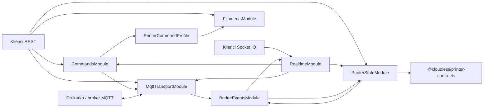
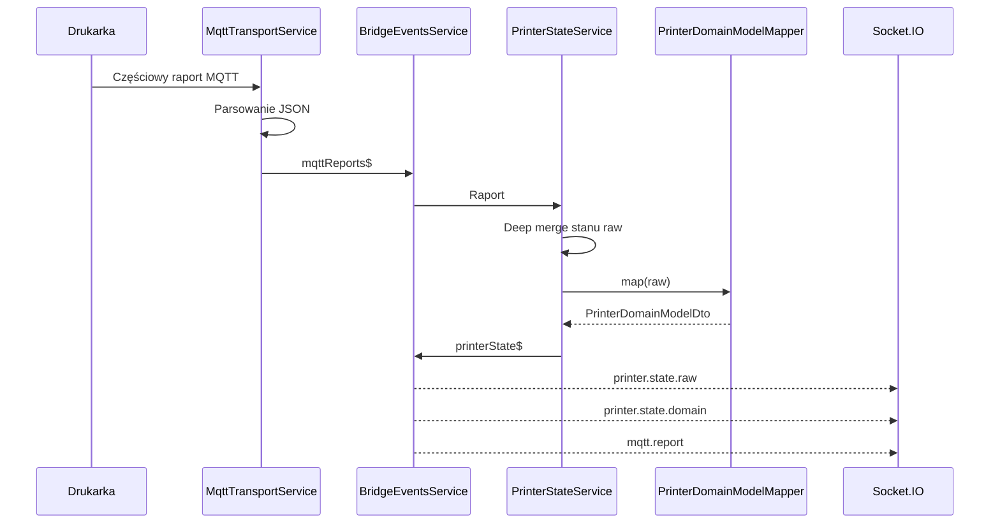
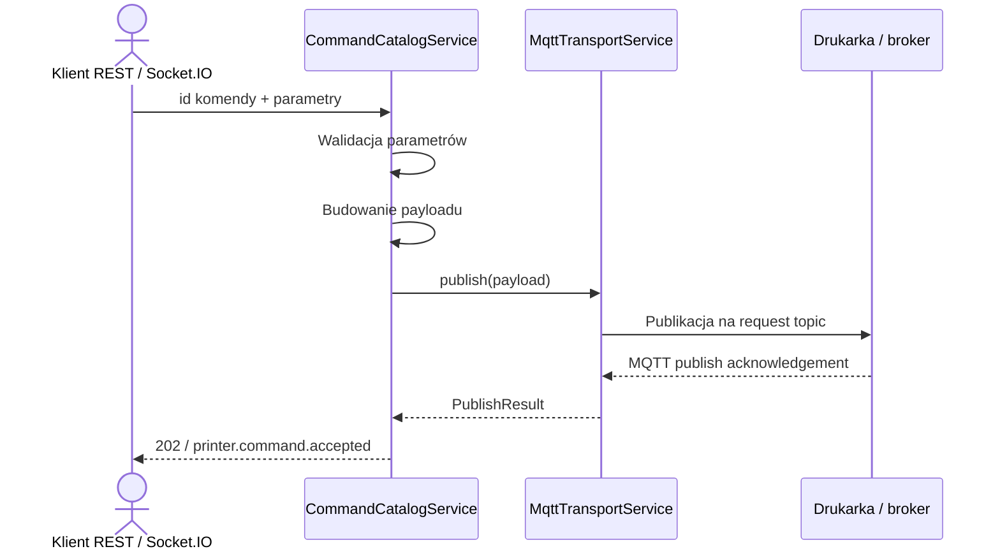

# Architektura mqtt-puppeteer

## Cel serwisu

`mqtt-puppeteer` jest lokalnym adapterem między protokołem MQTT/TLS drukarki a
aplikacjami korzystającymi z REST lub Socket.IO. Serwis:

1. odbiera częściowe raporty drukarki;
2. utrzymuje kompletny stan protokołowy przez deep merge;
3. mapuje stan na stabilny model biznesowy;
4. publikuje surowe albo nazwane komendy;
5. rozsyła statusy, raporty i oba modele stanu w czasie rzeczywistym.

## Moduły



### `AppConfigModule`

Globalny provider konfiguracji. Odpowiada za:

- wczytanie opcjonalnego `.env`;
- walidację liczb i wartości logicznych;
- zbudowanie domyślnych topiców z `PRINTER_SN`;
- konfigurację zewnętrznego katalogu komend;
- konfigurację katalogu filamentów i topologii AMS;
- wskazanie opcjonalnego template'u stanu.

Hasło MQTT pozostaje wyłącznie w konfiguracji procesu i nie jest ujawniane
przez publiczne API.

### `MqttTransportModule`

Adapter infrastrukturalny odpowiedzialny wyłącznie za MQTT:

- połączenie `mqtts`;
- MQTT 3.1.1 (`protocolVersion: 4`);
- subskrypcję topicu raportowego;
- parsowanie JSON lub zachowanie tekstu;
- publikację obiektów JSON do topicu komend;
- raportowanie stanu połączenia.

Transport nie mapuje modelu biznesowego, nie wykonuje deep merge i nie zna
Socket.IO. Raporty oraz status publikuje do `BridgeEventsService`.

Brak pełnej konfiguracji nie zatrzymuje aplikacji. Transport pozostaje wtedy
offline, dzięki czemu nadal działają odczyty, katalog i preview komend.

### `BridgeEventsModule`

Wewnętrzny bus zdarzeń oparty na `ReplaySubject(1)`:

- `mqttReports$`;
- `mqttStatus$`;
- `printerState$`.

Replay ostatniej wartości umożliwia późniejszym subskrybentom uzyskanie
aktualnego zdarzenia bez bezpośredniego wiązania modułów.

Bus jest granicą między transportem, projekcją stanu i Socket.IO. Nie zawiera
logiki biznesowej.

### `PrinterStateModule`

Odpowiada za dwie reprezentacje:

- `raw` — pełny obiekt protokołu drukarki;
- `domain` — stabilny `PrinterDomainModelDto`.

Serwis subskrybuje `mqttReports$`. Raport będący obiektem jest scalany ze
stanem raw, następnie mapper tworzy od nowa projekcję domenową i publikuje
`printerState$`.

#### Reguły deep merge

- obiekt + obiekt: scalanie rekurencyjne;
- tablica: zastąpienie całej tablicy;
- skalar lub `null`: zastąpienie;
- pole nieobecne w patchu: zachowanie;
- nowe pole: dodanie;
- `__proto__`, `constructor`, `prototype`: ignorowanie.

Stan zaczyna się od `{}`. Jeżeli ustawiono
`PRINTER_STATE_TEMPLATE_PATH`, zaczyna się od niezależnej kopii wskazanego
obiektu JSON.

Każdy publiczny odczyt zwraca kopię, aby konsument nie mógł zmienić stanu
przechowywanego przez proces.

### Mapper domenowy

Token `PRINTER_DOMAIN_MAPPER` oddziela mechanizm stanu od protokołu modelu
drukarki.

Aktualny provider `BambuLabA1Mapper`:

- mapuje temperatury;
- normalizuje status zadania;
- przelicza pozostały czas z minut na sekundy;
- mapuje postęp i warstwy;
- przelicza skalę wentylatorów `0..15` na procenty;
- mapuje światło, prędkość, AMS i zewnętrzną szpulę.

Dla innego protokołu należy dostarczyć nową implementację
`PrinterDomainModelMapper` i zmienić provider w `PrinterStateModule`. Deep
merge, REST, Socket.IO i kontrakt domenowy nie wymagają zmian.

### `CommandsModule`

Katalog komend jest osobną warstwą aplikacyjną:

1. wyszukuje definicję po `id`;
2. odrzuca nieznane parametry;
3. waliduje typ, wymaganie, enum, wzorzec i zakres;
4. deleguje budowanie do aktywnego profilu drukarki;
5. przekazuje payload do `MqttTransportService`.

Identyfikatory i parametry są kontraktem domenowym frontendu. Provider
`PRINTER_COMMAND_PROFILE` tłumaczy je na indywidualne pola protokołu
drukarki. Wbudowany profil A1 oraz jego definicje są częścią projektu; serwis
nie czyta ani nie modyfikuje `MQTT_WIKI` w runtime.

### `FilamentsModule`

Oddziela dane materiałowe od komend i konkretnej drukarki:

- typ definiuje `trayType`, kolor domyślny i zakres temperatur;
- metatyp wiąże typ z marką oraz `trayInfoIdx`;
- wynikowa definicja łączy oba zbiory i może zawierać nadpisania temperatur.

`FilamentCatalogService` jest używany przez profil komend podczas
`load-filament` oraz `set-filament`. Katalog może zostać zastąpiony lub
rozszerzony plikiem wskazanym przez `FILAMENT_CATALOG_PATH`.

### `PrinterCommandProfile`

Profil jest wymiennym adapterem między komendami domenowymi a MQTT konkretnej
drukarki. Udostępnia:

- identyfikator modelu/profilu;
- topologię `unitCount × slotsPerUnit` i informację o szpuli zewnętrznej;
- zbiór builderów komend.

Profil A1 mapuje źródło AMS na `ams_id`, lokalny `slot_id` i globalny
`target`. Dla szpuli zewnętrznej stosuje identyfikatory protokołu A1.
Inny model może dostarczyć własny provider bez zmiany API frontendu.

#### Wymiana profilu komend

`COMMAND_CATALOG_PATH` wskazuje plik JSON z definicjami:

- `COMMAND_CATALOG_MODE=replace` — używany jest wyłącznie wskazany katalog;
- `COMMAND_CATALOG_MODE=extend` — definicje są dołączane, a identyczne `id`
  nadpisują wbudowane.

Payload może korzystać z placeholderów `{{parameter}}`. Pełny placeholder
zachowuje typ JSON, a placeholder wewnątrz tekstu jest interpolowany jako
string.

`preview` korzysta z tej samej walidacji i tego samego buildera co wykonanie,
ale nie wywołuje transportu.

### `RealtimeModule`

Adapter Socket.IO pod namespace `/printer`. Nie tworzy klienta MQTT i nie
przetwarza raportów. Subskrybuje wewnętrzny bus i tłumaczy zdarzenia na:

- `mqtt.status`;
- `mqtt.report`;
- `printer.state.raw`;
- `printer.state.domain`.

Komendy przychodzące przez Socket.IO są delegowane do `CommandCatalogService`
albo bezpośrednio do transportu w przypadku świadomie użytej komendy raw.

### Kontrolery REST

Kontrolery są cienkimi adapterami:

- `MqttTransportController` — konfiguracja, status, ostatni raport i raw
  publish;
- `PrinterStateController` — snapshot, raw i domain;
- `RootPrinterStateController` — samodzielne endpointy `/json_model` i
  `/domain_model`;
- `CommandsController` — lista, preview i wykonanie nazwanych komend.
- `FilamentsController` — typy, metatypy i rozwiązane profile filamentów.

Pełny kontrakt znajduje się w [endpoints.md](./endpoints.md).

## Współdzielony kontrakt biznesowy

Model domenowy znajduje się w osobnym pakiecie:

```text
packages/printer-contracts
```

Import:

```ts
import type { PrinterDomainModelDto } from '@cloudless/printer-contracts';
```

Pakiet eksportuje również `PrinterCommandId`, parametry zarządzania
filamentem, `AmsTopologyDto` oraz definicje katalogu filamentów.

Pakiet jest niezależny od NestJS, MQTT i Socket.IO. Backend używa go podczas
mapowania i emisji zdarzeń, a przyszły frontend może użyć go dla:

- typowania odpowiedzi `GET /printer/state/domain`;
- pola `domain` w `GET /printer/state`;
- `state` zdarzenia `printer.state.domain`;
- store'u stanu i komponentów UI.

Kontrakt biznesowy nie zawiera nazw pól MQTT BambuLab. Zmiana protokołu
drukarki wymaga zmiany mappera, a nie frontendu.

## Przepływ raportu



Niepoprawny JSON pozostaje dostępny jako ostatni raport tekstowy, ale nie
zmienia stanu raw ani modelu domenowego.

## Przepływ nazwanej komendy



Odpowiedź drukarki wraca niezależnym przepływem raportowym. Publish
acknowledgement nie jest równoznaczny z wykonaniem polecenia przez urządzenie.

## Rozszerzanie serwisu

### Inny zestaw komend, ten sam protokół raportów

Wystarczy ustawić `COMMAND_CATALOG_PATH` oraz tryb katalogu. Kod nie wymaga
przebudowy.

### Inny model drukarki z podobnym transportem

Należy:

1. skonfigurować topics przez `MQTT_REPORT_TOPIC` i `MQTT_COMMAND_TOPIC`;
2. dostarczyć katalog komend;
3. dodać mapper do `PrinterDomainModelDto`;
4. opcjonalnie wskazać template raw.

### Rozszerzenie modelu biznesowego

Zmiana zaczyna się w `@cloudless/printer-contracts`. Następnie należy
zaktualizować mapper oraz konsumentów. Dzięki temu TypeScript wykryje miejsca,
które wymagają dostosowania, zarówno w backendzie, jak i frontendzie.

## Ograniczenia bieżącej implementacji

- stan jest przechowywany w pamięci procesu;
- restart zeruje stan do `{}` albo template'u;
- skonfigurowana jest jedna drukarka na proces;
- Socket.IO CORS ma obecnie `origin: '*'`;
- TLS A1 domyślnie używa `rejectUnauthorized: false`;
- semantyka potwierdzenia wykonania komendy zależy od raportu danego modelu.

Przy wdrożeniu poza zaufaną siecią lokalną należy ograniczyć CORS, dodać
uwierzytelnienie REST/Socket.IO oraz rozważyć certyfikaty z włączoną
weryfikacją.
