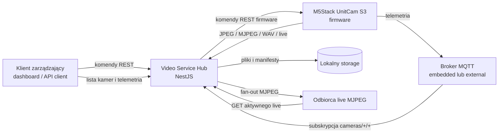
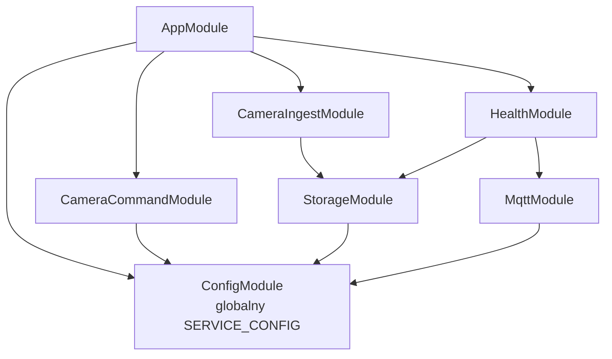
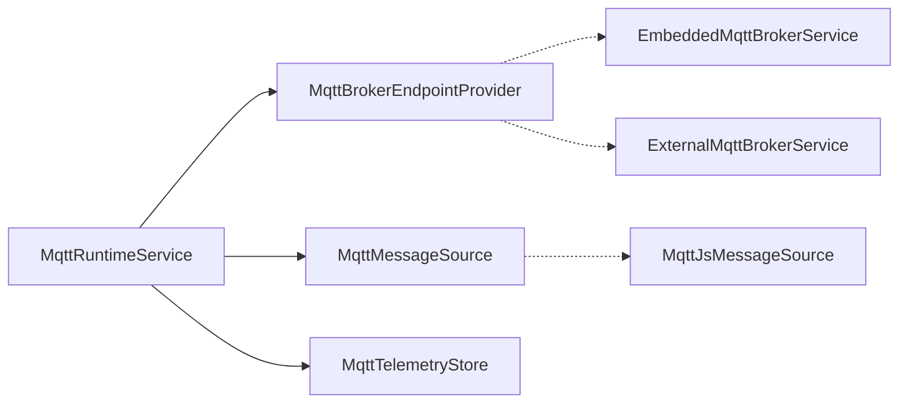
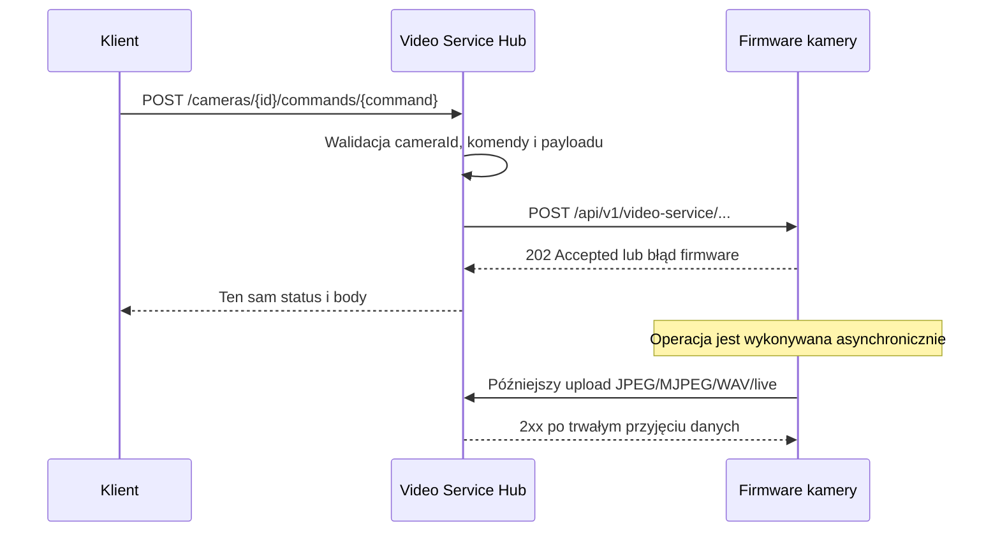
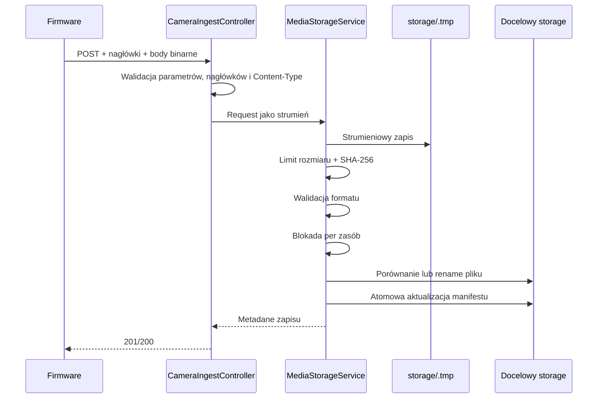
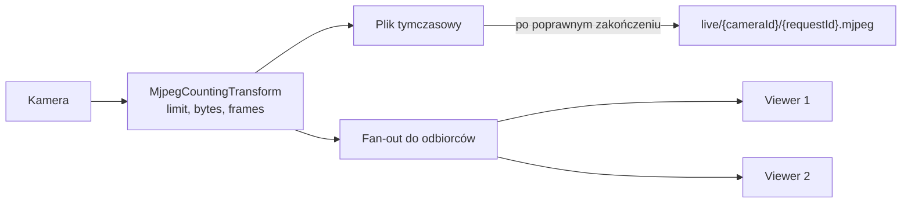
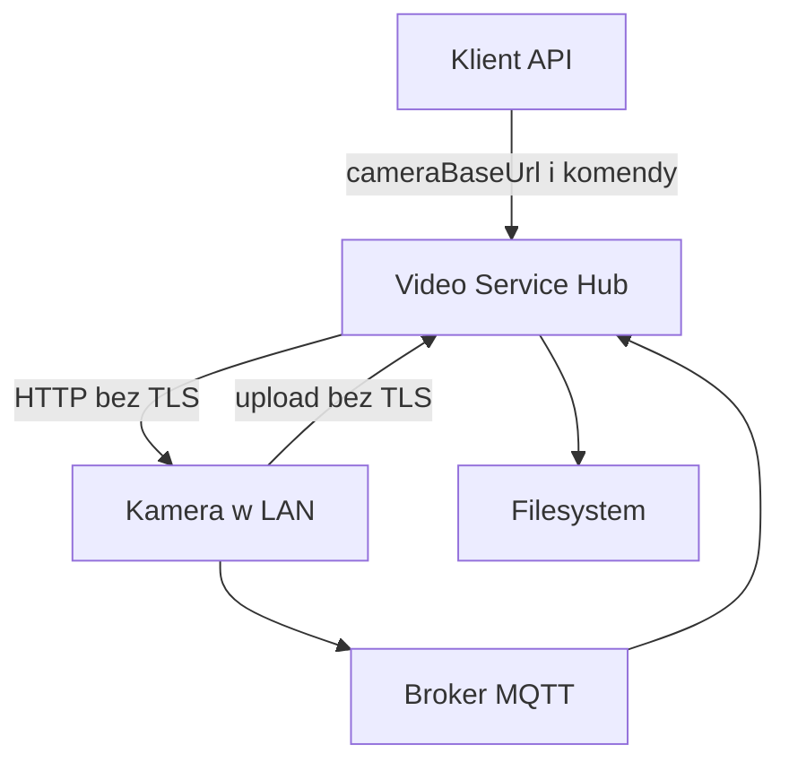

# Architektura Video Service Hub

## 1. Cel dokumentu

Ten dokument opisuje aktualną architekturę serwisu
`apps/video-service-hub`: jego odpowiedzialności, moduły, przepływy danych,
model trwałości, punkty integracji oraz kierunki dalszej rozbudowy.

Video Service Hub jest lokalnym backendem pośredniczącym między:

- klientami zarządzającymi kamerami;
- firmware kamer M5Stack UnitCam S3;
- lokalnym lub zewnętrznym brokerem MQTT;
- trwałym magazynem zdjęć, nagrań, audio i transmisji live;
- przyszłymi modułami katalogowania, łączenia i odtwarzania nagrań.

Serwis działa w zaufanej sieci lokalnej i nie jest obecnie bramą dostępną
bezpośrednio z Internetu.

## 2. Zakres odpowiedzialności

### Serwis odpowiada za

- walidowanie i przekazywanie komend HTTP do firmware kamery;
- odbieranie binarnych danych wysyłanych przez kamerę;
- bezpieczny, strumieniowy zapis dużych plików bez buforowania ich w pamięci;
- atomową publikację kompletnych materiałów;
- idempotencję retry tam, gdzie protokół dostarcza jednoznaczny klucz zasobu;
- utrzymywanie manifestów zdjęć i wieloczęściowych nagrań;
- udostępnianie aktywnego strumienia MJPEG wielu odbiorcom;
- uruchomienie lokalnego brokera MQTT albo podłączenie brokera zewnętrznego;
- obserwowanie telemetrii kamer i wyliczanie ich statusu online;
- raportowanie gotowości storage i MQTT.

### Serwis obecnie nie odpowiada za

- uwierzytelnianie użytkowników i autoryzację operacji;
- rejestrowanie kamer w trwałej bazie danych;
- transkodowanie lub łączenie części MJPEG;
- generowanie miniaturek;
- odtwarzanie zakończonych nagrań przez API;
- retencję i automatyczne usuwanie starych materiałów;
- przechowywanie telemetrycznej historii zdarzeń;
- replikację storage;
- zarządzanie konfiguracją firmware kamery.

Te elementy są przewidziane jako kolejne warstwy, ale nie powinny być dodawane
bezpośrednio do kontrolerów ingestu ani do niskopoziomowego storage.

## 3. Kontekst systemowy



Najważniejsza cecha tego układu to dwukierunkowa relacja HTTP:

1. klient zleca operację przez Hub, a Hub wywołuje endpoint firmware;
2. firmware wykonuje operację asynchronicznie i później samodzielnie wysyła
   wynik do endpointu ingestowego Hub.

Odpowiedź `202 Accepted` firmware oznacza przyjęcie zadania, a nie zakończenie
zapisu materiału.

## 4. Architektura modułowa NestJS



`ConfigModule` jest modułem globalnym. Pozostałe moduły otrzymują jeden,
zwalidowany obiekt `ServiceConfig` przez token `SERVICE_CONFIG`, zamiast
odczytywać `process.env` w wielu miejscach.

### 4.1. `CameraCommandModule`

Odpowiada za synchroniczną część komunikacji klient → Hub → kamera.

Składniki:

- `CameraCommandController` — publiczna trasa komend;
- `CameraCommandService` — wykonanie żądania HTTP do firmware;
- `camera-command.validator.ts` — walidacja parametrów zgodna z limitami
  firmware;
- `camera-command.types.ts` — zamknięta mapa nazw komend na endpointy urządzenia.

Moduł:

- sprawdza `cameraId`;
- sprawdza nazwę komendy;
- wymaga `cameraBaseUrl` będącego originem HTTP bez ścieżki i credentials;
- usuwa `cameraBaseUrl` z payloadu wysyłanego do kamery;
- waliduje wymagane pola konkretnej komendy;
- stosuje konfigurowalny timeout;
- przekazuje status HTTP, `Content-Type` i body odpowiedzi firmware.

### 4.2. `CameraIngestModule`

Stanowi wejściową warstwę HTTP dla danych wysyłanych przez firmware.

`CameraIngestController`:

- waliduje parametry ścieżki;
- waliduje wymagane nagłówki;
- rozpoznaje dokładny typ mediów;
- nie buforuje body jako JSON;
- przekazuje strumień `Request` do `MediaStorageService`;
- zestawia połączenie odbiorcy z aktywnym live.

Kontroler nie implementuje logiki systemu plików. Dzięki temu sposób
przechowywania danych może zostać w przyszłości zastąpiony bez zmiany
kontraktu HTTP.

### 4.3. `StorageModule`

Centralnym komponentem jest `MediaStorageService`.

Odpowiada on za:

- inicjalizację wymaganych katalogów;
- usuwanie osieroconych plików tymczasowych po restarcie;
- odtworzenie manifestów z dysku;
- limity rozmiaru uploadów;
- liczenie SHA-256 i rozmiaru podczas zapisu;
- walidację podstawowej struktury JPEG, WAV i MJPEG;
- publikację plików po kompletnym zapisie;
- kontrolę konfliktów i duplikatów;
- aktualizację manifestów;
- serializację operacji dotyczących tego samego zasobu;
- zapis i dystrybucję transmisji live;
- raportowanie stanu storage.

`KeyedLock` zapewnia lokalną blokadę per logiczny zasób, na przykład:

```text
capture:{cameraId}:{requestId}
recording:{cameraId}:{requestId}
audio:{cameraId}:{requestId}
live:{cameraId}:{requestId}
```

Blokada nie zatrzymuje uploadu sieciowego. Dane najpierw trafiają do unikalnego
pliku tymczasowego, a sekcja krytyczna obejmuje dopiero porównanie, publikację
i zmianę manifestu.

### 4.4. `MqttModule`

Warstwa MQTT jest rozdzielona na porty i adaptery.



Port `MqttBrokerEndpointProvider` rozdziela pozyskanie endpointu brokera od
konsumpcji wiadomości:

- bez `MQTT_URL` wybierany jest broker embedded oparty na Aedes;
- z `MQTT_URL` wybierany jest adapter brokera zarządzanego zewnętrznie.

Port `MqttMessageSource` abstrahuje klienta subskrybującego. Obecna
implementacja korzysta z MQTT.js.

`MqttTelemetryStore` przechowuje:

- ostatnią wiadomość dla każdej pary kamera–kanał;
- czas pierwszego i ostatniego kontaktu;
- czas ostatniego heartbeat;
- ostatni kanał;
- liczbę odebranych wiadomości;
- wyliczony status online.

Store jest obecnie pamięciowy. Restart procesu usuwa telemetrię, ale nie usuwa
materiałów ani manifestów z dysku.

### 4.5. `HealthModule`

Endpoint `/health` agreguje stan:

- gotowości storage;
- połączenia obserwatora MQTT;
- trybu i stanu brokera;
- aktywnych oraz ostatnio zakończonych transmisji.

Status:

- `ok` — storage jest gotowy i obserwator MQTT jest połączony;
- `degraded` — co najmniej jeden z tych warunków nie jest spełniony.

Health endpoint nie sprawdza dostępności każdej kamery i nie wykonuje próbnych
zapisów na dysku przy każdym wywołaniu.

## 5. Powierzchnia HTTP

### 5.1. Komendy do firmware

```text
POST /api/v1/cameras/:cameraId/commands/:command
```

| Komenda publiczna | Endpoint firmware |
| --- | --- |
| `capture` | `/api/v1/video-service/captures` |
| `periodic-capture` | `/api/v1/video-service/captures/periodic` |
| `timed-recording` | `/api/v1/video-service/recordings/timed` |
| `start-recording` | `/api/v1/video-service/recordings/start` |
| `stop-recording` | `/api/v1/video-service/recordings/stop` |
| `start-live` | `/api/v1/video-service/live/start` |
| `start-dynamic-live` | `/api/v1/video-service/live/dynamic/start` |
| `stop-live` | `/api/v1/video-service/live/stop` |
| `record-audio` | `/api/v1/video-service/audio` |

### 5.2. Ingest z kamery

| Metoda | Endpoint | Dane |
| --- | --- | --- |
| `POST` | `/api/v1/cameras/:cameraId/captures` | pojedynczy JPEG |
| `POST` | `/api/v1/cameras/:cameraId/recordings/:requestId/parts/:partNumber` | część nagrania MJPEG |
| `POST` | `/api/v1/cameras/:cameraId/audio` | WAV |
| `POST` | `/api/v1/cameras/:cameraId/live` | przychodzący live MJPEG |
| `GET` | `/api/v1/cameras/:cameraId/live` | oglądanie aktywnego live |

### 5.3. Odczyt kamer i diagnostyka

| Metoda | Endpoint | Dane |
| --- | --- | --- |
| `GET` | `/api/v1/cameras` | kamery zaobserwowane przez MQTT |
| `GET` | `/api/v1/cameras/:cameraId/telemetry` | ostatnia telemetria kamery |
| `GET` | `/health` | stan całego procesu |

Trasy testowe PoC, takie jak kasowanie storage czy wymuszanie awarii, celowo nie
są częścią API serwisu.

## 6. Przepływ komendy



Timeout połączenia z firmware nie oznacza anulowania operacji na urządzeniu.
Jeżeli kamera przyjęła żądanie tuż przed zerwaniem połączenia, zadanie może
nadal zostać wykonane i później wysłać materiał do Hub.

## 7. Przepływ zapisu materiału



Body nie jest ładowane w całości do pamięci podczas zwykłego zapisu.
Wyjątkiem jest końcowa kontrola kompletności JPEG, która odczytuje plik po
zapisaniu go do katalogu tymczasowego.

## 8. Model storage

```text
storage/
├── captures/
│   └── {cameraId}/{requestId}/
│       ├── 000000.jpg
│       ├── 000001.jpg
│       └── manifest.json
├── recordings/
│   └── {cameraId}/{requestId}/
│       ├── part-0000.mjpeg
│       ├── part-0001.mjpeg
│       └── manifest.json
├── audio/
│   └── {cameraId}/{requestId}.wav
├── live/
│   └── {cameraId}/{requestId}.mjpeg
└── .tmp/
```

### 8.1. Manifest zdjęć

Manifest grupuje zdjęcia według:

```text
cameraId + requestId + resolution
```

Każdy wpis zawiera:

- numer sekwencji;
- nazwę pliku;
- rozmiar;
- SHA-256;
- czas zapisu.

### 8.2. Manifest nagrania

Manifest nagrania zawiera:

- `schemaVersion`;
- `cameraId`;
- `requestId`;
- rozdzielczość;
- oczekiwaną liczbę części;
- żądany czas nagrania;
- całkowitą liczbę klatek;
- listę odebranych części;
- metadane każdej części;
- flagę `complete`;
- czas utworzenia i aktualizacji.

Nagranie otrzymuje `complete: true` tylko wtedy, gdy odebrano dokładnie
wszystkie części od `0` do `totalParts - 1`.

## 9. Spójność i idempotencja

Idempotencja opiera się na logicznym kluczu zasobu i porównaniu:

```text
rozmiar + SHA-256
```

Jeżeli plik docelowy istnieje:

- identyczna zawartość jest traktowana jako poprawny retry;
- inna zawartość pod tym samym kluczem powoduje `409 Conflict`.

Dotyczy to:

- części nagrania;
- pliku audio;
- zakończonego live o tym samym identyfikatorze;
- zdjęcia, gdy kamera dostarcza `X-Capture-Sequence`.

### Ograniczenie protokołu capture

Aktualne firmware nie wysyła jednoznacznego numeru pliku zdjęcia. Bez
`X-Capture-Sequence` Hub nadaje kolejną sekwencję lokalnie. Zachowuje to
wszystkie klatki okresowego capture, lecz po utracie odpowiedzi HTTP nie da się
odróżnić:

- ponowienia uploadu tego samego zdjęcia;
- kolejnego zdjęcia o identycznej zawartości.

Pełne rozwiązanie wymaga rozszerzenia protokołu firmware o trwały identyfikator
klatki lub numer sekwencji.

### Zakres gwarancji blokad

`KeyedLock` działa w obrębie jednego procesu Node.js. Chroni przed wyścigami
między równoległymi requestami tej instancji, ale nie zapewnia blokady
rozproszonej.

W obecnej architekturze nie należy uruchamiać wielu instancji Hub zapisujących
do tego samego katalogu bez dodatkowej koordynacji.

## 10. Transmisja live

Live realizuje równolegle dwa cele:

1. zapis całego przychodzącego MJPEG do pliku;
2. dystrybucję bieżących fragmentów do podłączonych odbiorców.



Aktywna transmisja jest kluczowana przez:

```text
cameraId + requestId
```

Odbiorca:

- może wskazać `requestId`;
- bez `requestId` otrzymuje aktywną transmisję danej kamery;
- dołącza od najbliższej pełnej granicy części MJPEG;
- nie otrzymuje niepełnego fragmentu klatki sprzed momentu połączenia.

Każdy viewer posiada ograniczony bufor. Wolny odbiorca, którego bufor
przekroczy `LIVE_VIEWER_BUFFER_BYTES`, jest odłączany. Dzięki temu pojedynczy
klient nie zatrzymuje zapisu kamery ani pozostałych odbiorców.

Po zakończeniu przychodzącego streamu:

- strumienie viewerów są zamykane;
- aktywny wpis jest usuwany;
- plik tymczasowy jest publikowany;
- metadane trafiają do ograniczonej pamięci ostatnio zakończonych live.

## 11. Telemetria MQTT

Hub subskrybuje:

```text
cameras/+/+
```

Akceptowane kanały:

- `heartbeat`;
- `led`;
- `microphone`;
- `status`;
- `network`;
- `state`;
- `upload`.

Payload jest parsowany jako JSON. Jeśli parsowanie się nie powiedzie, surowy
tekst nadal pozostaje dostępny diagnostycznie.

Status online nie pochodzi ze stanu połączeń brokera. Jest obliczany na
podstawie czasu ostatniej wiadomości:

```text
online = now - lastSeenAt <= MQTT_CAMERA_ONLINE_TTL_MS
```

Dzięki temu model działa identycznie z brokerem embedded i external.

## 12. Konfiguracja runtime

| Zmienna | Domyślnie | Odpowiedzialność |
| --- | ---: | --- |
| `HOST` | `0.0.0.0` | adres HTTP |
| `PORT` | `3000` | port HTTP |
| `STORAGE_PATH` | `./storage` | katalog materiałów |
| `CAMERA_COMMAND_TIMEOUT_MS` | `10000` | timeout wywołania firmware |
| `MQTT_PORT` | `1883` | port brokera embedded |
| `MQTT_URL` | brak | wybór brokera external |
| `MQTT_USERNAME` | brak | użytkownik brokera external |
| `MQTT_PASSWORD` | brak | hasło brokera external |
| `MQTT_CONNECT_TIMEOUT_MS` | `10000` | timeout pierwszego połączenia MQTT |
| `MQTT_RECONNECT_PERIOD_MS` | `1000` | odstęp reconnect |
| `MQTT_CAMERA_ONLINE_TTL_MS` | `60000` | czas uznania kamery za online |
| `CAPTURE_MAX_BYTES` | `20 MiB` | limit JPEG |
| `RECORDING_PART_MAX_BYTES` | `16 MiB` | limit części MJPEG |
| `AUDIO_MAX_BYTES` | `10 MiB` | limit WAV |
| `LIVE_MAX_BYTES` | `1 GiB` | limit pojedynczego live |
| `LIVE_VIEWER_BUFFER_BYTES` | `2 MiB` | bufor pojedynczego viewera |

Konfiguracja jest ładowana przy starcie procesu. Niepoprawna liczba, port lub
limit zatrzymuje start aplikacji zamiast pozostawiać częściowo działający
serwis.

## 13. Cykl życia procesu

### Start

1. NestJS tworzy `AppModule`.
2. `ConfigModule` buduje i waliduje `ServiceConfig`.
3. `MediaStorageService` tworzy katalogi i czyści `.tmp`.
4. Manifesty capture i recordings są wczytywane do pamięci.
5. `MqttRuntimeService` uruchamia lub wybiera broker.
6. Klient MQTT łączy się i subskrybuje telemetrię.
7. Serwer HTTP rozpoczyna nasłuch.

### Zamykanie

`enableShutdownHooks()` uruchamia lifecycle NestJS:

1. klient MQTT kończy połączenie;
2. broker embedded jest zamykany;
3. NestJS kończy obsługę aplikacji.

Pliki w trakcie zapisu pozostają w `.tmp` i są usuwane przy kolejnym starcie.
Nie są publikowane jako kompletne materiały.

## 14. Obsługa błędów

| Kod | Znaczenie |
| ---: | --- |
| `400` | niepoprawny identyfikator, nagłówek, typ mediów lub payload |
| `404` | brak pasującego aktywnego live |
| `409` | konflikt istniejącego zasobu lub aktywna transmisja |
| `413` | przekroczenie limitu uploadu |
| `502` | timeout lub błąd połączenia z firmware |
| `5xx` | nieoczekiwany błąd storage albo infrastruktury |

Firmware traktuje odpowiedź 2xx jako potwierdzenie uploadu. Odpowiedź błędna
powinna pozostawić materiał w trwałej kolejce urządzenia, aby mógł zostać
ponowiony.

## 15. Granice bezpieczeństwa



Aktualne założenia:

- Hub i kamery działają w zaufanej sieci LAN;
- firmware komunikuje się po HTTP;
- embedded MQTT nie posiada warstwy uwierzytelniania;
- endpoint komend przyjmuje `cameraBaseUrl` od klienta;
- API nie implementuje autoryzacji.

Przed udostępnieniem poza LAN należy dodać:

1. uwierzytelnianie i role;
2. trwały rejestr kamer;
3. wybór kamery po `cameraId`, bez dowolnego `cameraBaseUrl` od klienta;
4. allowlistę adresów sieciowych;
5. TLS na reverse proxy;
6. limity requestów i ochronę przed nadużyciem;
7. credentials lub ACL brokera MQTT;
8. kontrolę dostępu do zapisanych materiałów.

## 16. Skalowanie i ograniczenia wdrożeniowe

Aktualna wersja jest zaprojektowana jako pojedyncza instancja:

- stan aktywnych live znajduje się w pamięci;
- viewer musi trafić do procesu odbierającego upload;
- telemetria jest pamięciowa;
- blokady są procesowe;
- storage jest lokalnym systemem plików.

Skalowanie horyzontalne wymagałoby co najmniej:

- routingu sticky dla live albo zewnętrznego systemu dystrybucji streamu;
- rozproszonej blokady lub transakcyjnego repozytorium manifestów;
- współdzielonego object storage;
- trwałej bazy metadanych;
- współdzielonego event bus;
- rozdzielenia ingestu od obróbki materiałów.

## 17. Planowane punkty rozszerzeń

### 17.1. Repozytorium metadanych

Warto dodać osobną warstwę:

```text
RecordingRepository
CaptureRepository
CameraRepository
```

Nie należy rozszerzać plikowych manifestów do roli pełnej bazy wyszukiwania.
Manifest powinien pozostać opisem spójności materiału na storage.

### 17.2. Pipeline post-processingu

Po oznaczeniu nagrania jako kompletne może zostać opublikowane zdarzenie:

```text
recording.completed
```

Osobny worker może następnie:

- połączyć części;
- przepakować MJPEG do formatu wygodnego dla odtwarzacza;
- wygenerować miniaturę;
- obliczyć czas i parametry materiału;
- zaktualizować repozytorium nagrań.

Operacje te nie powinny blokować odpowiedzi HTTP dla firmware.

### 17.3. API zarządzania nagraniami

Docelowa warstwa może udostępniać:

- listowanie i filtrowanie materiałów;
- szczegóły nagrania;
- odtwarzanie z obsługą zakresów;
- pobieranie oryginału;
- oznaczanie i opisy;
- retencję i usuwanie;
- miniatury;
- stan post-processingu.

### 17.4. Trwała telemetria

`MqttTelemetryStore` może zostać uzupełniony adapterem repozytorium lub
publikowaniem zdarzeń. Bieżący store powinien nadal odpowiadać za szybki
snapshot aktualnego stanu.

## 18. Testowanie architektury

Testy jednostkowe obejmują:

- mapowanie i walidację komend;
- proxy do firmware;
- idempotentny capture z sekwencją;
- odtworzenie manifestu po restarcie;
- idempotentny retry części nagrania;
- fan-out aktywnego live od pełnej granicy MJPEG.

Testy E2E uruchamiają:

- kompletną aplikację NestJS;
- broker embedded na losowym porcie;
- inicjalizację tymczasowego storage;
- health check;
- upload firmware-compatible JPEG;
- walidację niepoprawnego typu mediów.

Najważniejsze przyszłe scenariusze testowe:

- równoległy upload części tego samego nagrania;
- przerwanie procesu podczas zapisu pliku i manifestu;
- przekroczenie każdego limitu;
- wolny viewer live;
- restart i reconnect brokera zewnętrznego;
- wiele kamer wysyłających live jednocześnie;
- pełny test sprzętowy z UnitCam S3.

## 19. Najważniejsze decyzje architektoniczne

1. **Strumieniowy zapis zamiast buforowania** — materiały mogą być duże i nie
   powinny zwiększać pamięci procesu proporcjonalnie do rozmiaru.
2. **Pliki tymczasowe i publikacja po sukcesie** — konsumenci nie widzą
   częściowo zapisanego materiału.
3. **SHA-256 dla idempotencji** — retry może zostać rozpoznany bez zaufania do
   samej nazwy pliku.
4. **Manifest obok materiału** — podstawowe metadane spójności przeżywają
   restart bez bazy danych.
5. **Blokada per zasób** — równoległe kamery nie blokują się wzajemnie.
6. **Porty MQTT** — umiejscowienie brokera nie jest związane z logiką
   telemetrii.
7. **Pamięciowy live fan-out** — minimalizuje opóźnienie, ale świadomie
   ogranicza bieżącą wersję do pojedynczej instancji.
8. **Brak publicznych tras testowych** — operacje destrukcyjne nie należą do
   produkcyjnego API.
9. **Fail-fast konfiguracji** — błędna konfiguracja nie tworzy pozornie
   działającego procesu.
10. **Rozdzielenie ingestu od przyszłego post-processingu** — przyjęcie danych
    od firmware pozostaje szybkie i niezależne od ciężkich operacji wideo.
